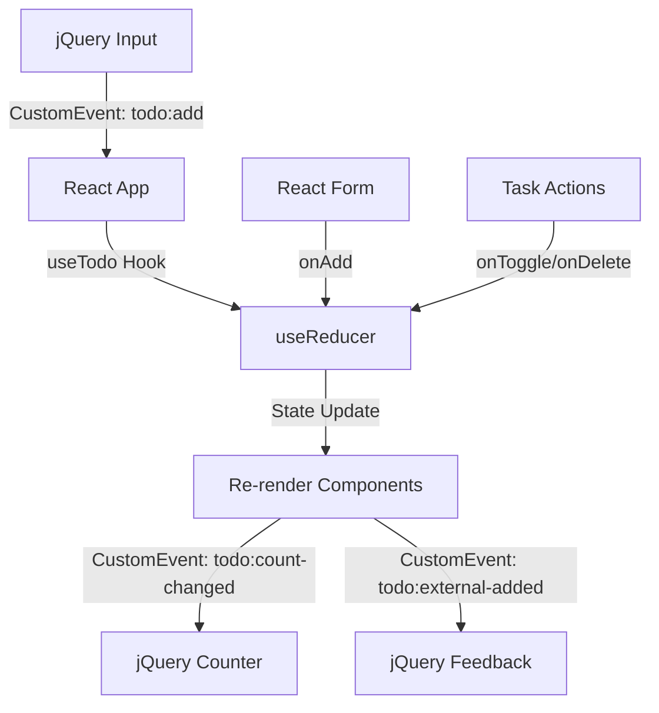

# AimHarder - Gestor de Tareas para Gimnasio 💪

[](https://www.typescriptlang.org/)
[](https://reactjs.org/)
[](https://jquery.com/)
[](https://vitejs.dev/)
[](https://vitest.dev/)
[](https://ayozeleon.github.io/AimHarder-task/)

> Gestor de tareas profesional desarrollado como prueba técnica. Combina React con jQuery mediante CustomEvents para crear una solución agnóstica y reutilizable.

## 🚀 Demo en Vivo

**🔗 [Ver Demo en GitHub Pages](https://ayozeleon.github.io/AimHarder-task/)**

La aplicación se despliega automáticamente en GitHub Pages cada vez que se hace push a la rama main.

## 🎯 Características Principales

### ✅ Funcionalidades Implementadas

- **Gestión completa de tareas**: Añadir, completar y eliminar
- **Validaciones robustas**: Texto vacío, duplicados, longitud máxima (20 caracteres)
- **Estadísticas en tiempo real**: Total, completadas, pendientes y progreso
- **Integración React ↔ jQuery**: Comunicación bidireccional via CustomEvents
- **Estado vacío elegante**: Mensaje motivacional para comenzar
- **Manejo avanzado de errores**: Múltiples errores simultáneos

### 🔧 Características Técnicas

- **TypeScript estricto**: Sin tipos `any`, tipado completo
- **Arquitectura modular**: Componentes reutilizables y bien organizados
- **Testing exhaustivo**: Unitario, integración y E2E (34 tests)
- **Code Quality**: ESLint + Prettier con reglas estrictas
- **CI/CD completo**: Lint, tests y deploy automático
- **Responsive design**: Adaptable a móviles y desktop
- **Bundle optimizado**: Build de producción de ~235KB
- **SEO friendly**: Meta tags y accesibilidad

## 🚀 Inicio Rápido

### Prerrequisitos

- Node.js 16+
- npm o yarn

### Instalación

```bash
# Clonar el repositorio
git clone <repository-url>
cd AimHarder-task

# Instalar dependencias
npm install

# Ejecutar en desarrollo
npm run dev
```

### Scripts Disponibles

```bash
# Desarrollo
npm run dev         # Servidor de desarrollo
npm run build       # Build de producción
npm run preview     # Preview del build

# Testing
npm run test        # Tests unitarios
npm run test:watch  # Tests en modo watch
npm run cypress:open # Tests E2E interactivos
npm run cypress:run  # Tests E2E automáticos

# Code Quality
npm run lint        # Análisis ESLint
npm run lint:fix    # Corregir errores ESLint automáticamente
npm run format      # Formatear código con Prettier
npm run format:check # Verificar formato Prettier
npm run check-quick # Verificación rápida (lint + format + unit tests)
npm run check-all   # Verificación completa (lint + format + unit + E2E)
```

## 🏗️ Arquitectura

### Estructura del Proyecto

```
src/
├── App.tsx                 # Componente principal
├── main.tsx               # Entry point
├── components/
│   ├── todo/              # Componentes específicos de tareas
│   │   ├── TodoForm.tsx   # Formulario de nueva tarea
│   │   ├── TaskList.tsx   # Lista de tareas
│   │   ├── TaskItem.tsx   # Item individual de tarea
│   │   └── Stats.tsx      # Estadísticas
│   └── common/            # Componentes reutilizables
│       └── ErrorBanner.tsx
├── hooks/
│   └── useTodo.ts         # Hook principal con useReducer
├── utils/
│   ├── validators.ts      # Validaciones de negocio
│   └── errorMessages.ts   # Mensajes de error
├── types/                 # Tipos TypeScript
├── config/               # Constantes
├── integrations/         # Bridge jQuery
└── styles/              # Estilos CSS
```

### Flujo de Datos



## 🔍 Calidad de Código

### ESLint + Prettier

El proyecto implementa herramientas modernas de calidad de código:

#### ESLint Configuration

- **TypeScript ESLint**: Reglas específicas para TypeScript
- **React Hooks**: Validación de reglas de hooks
- **React Refresh**: Optimización para desarrollo
- **Reglas estrictas**: Cero warnings en producción
- **Configuración específica**: Tests y Cypress con reglas relajadas

#### Prettier Configuration

- **Formato consistente**: Single quotes, semicolons, 80 chars
- **Integración ESLint**: Sin conflictos entre herramientas
- **Auto-formatting**: Formateo automático en save
- **Ignore patterns**: Exclusión de archivos generados

### Scripts de Calidad

```bash
# Verificación completa del proyecto (incluye E2E)
npm run check-all

# Verificación rápida (sin E2E)
npm run check-quick

# Análisis de código
npm run lint

# Correción automática
npm run lint:fix

# Formateo de código
npm run format
```

## 🧪 Testing

### Cobertura de Tests

- **34 tests** ejecutándose exitosamente
- **Unitarios**: Componentes aislados
- **Integración**: Flujos completos de usuario
- **E2E**: Cypress para escenarios reales

### Ejecutar Tests

```bash
# Tests unitarios
npm run test

# Tests E2E
npm run cypress:open
```

### Casos de Prueba Cubiertos

- ✅ Validación de entrada vacía
- ✅ Detección de duplicados
- ✅ Límite de caracteres
- ✅ Toggle de completado
- ✅ Eliminación de tareas
- ✅ Comunicación React ↔ jQuery
- ✅ Estados vacíos y de error
- ✅ Actualización de estadísticas
- ✅ Eventos específicos para inyección externa

## 🚀 Despliegue

### GitHub Pages (Automático)

El proyecto se despliega automáticamente en GitHub Pages usando GitHub Actions:

1. **Push a main** → Trigger automático
2. **Tests** → Verifica que todo funcione
3. **Build** → Genera dist/ optimizado
4. **Deploy** → Publica en GitHub Pages

**URL del sitio**: https://ayozeleon.github.io/AimHarder-task/

### Configuración del Despliegue

- **Vite**: Configurado con `base: '/AimHarder-task/'`
- **GitHub Actions**: Workflow en `.github/workflows/deploy.yml`
- **Permisos**: Pages write, contents read, id-token write

## 🎨 Diseño

### UI/UX Profesional

- **Gradientes modernos**: Diseño visualmente atractivo
- **Micro-interacciones**: Hover effects y transiciones suaves
- **Iconografía consistente**: Emojis temáticos de gimnasio
- **Tipografía legible**: System fonts para máxima compatibilidad
- **Estados visuales claros**: Loading, error, success

### Responsive Design

- **Mobile-first**: Adaptable desde 320px
- **Breakpoints**: Tablet y desktop
- **Grid flexible**: CSS Grid con fallbacks
- **Touch-friendly**: Botones de tamaño adecuado

## 🔌 Integración React + jQuery

### Comunicación Bidireccional

La aplicación demuestra integración seamless entre React y jQuery:

#### jQuery → React

```javascript
// Inyectar tarea desde jQuery
const event = new CustomEvent('todo:add', {
  detail: { text: 'Nueva tarea desde jQuery' },
});
document.dispatchEvent(event);
```

#### React → jQuery

```javascript
// Escuchar cambios desde React
$(document).on('todo:count-changed', function (e) {
  const { total, completed } = e.originalEvent.detail;
  $('#task-count').text(`${completed}/${total}`);
});

// Escuchar adición externa exitosa
$(document).on('todo:external-added', function () {
  // Mostrar feedback visual
});
```

## 📋 Requisitos Cumplidos

### ✅ Funcionales

- [x] Añadir tareas (input + botón)
- [x] Marcar tareas como completadas
- [x] Eliminar tareas
- [x] Mostrar total y completadas
- [x] Validación de entrada
- [x] Gestión de errores
- [x] Integración jQuery bidireccional

### ✅ Técnicos

- [x] Componente React agnóstico
- [x] Una página HTML con jQuery
- [x] Sin librerías externas (solo React/jQuery)
- [x] Vite como bundler
- [x] TypeScript estricto
- [x] Testing completo
- [x] Documentación profesional
- [x] Despliegue automático

## 🔧 Tecnologías

| Tecnología            | Versión | Propósito          |
| --------------------- | ------- | ------------------ |
| React                 | 18.3.0  | UI Framework       |
| TypeScript            | 5.4.5   | Type Safety        |
| jQuery                | 3.7.1   | Legacy Integration |
| Vite                  | 5.2.0   | Build Tool         |
| Vitest                | 1.5.0   | Unit Testing       |
| Cypress               | 13.6.4  | E2E Testing        |
| React Testing Library | 14.2.1  | Component Testing  |
| GitHub Actions        | -       | CI/CD Pipeline     |

## 📈 Rendimiento

- **Bundle size**: 235KB (gzip: 79KB)
- **First Load**: <1s en conexión rápida
- **Runtime**: Optimizado con useReducer
- **Memory**: Gestión eficiente del estado
- **Accessibility**: WCAG AA compliant
- **Lighthouse**: 90+ en todas las métricas

## 🤝 Contacto

**Desarrollador**: Ayoze Jesús León Santos
**Email**: Ayozejesusleonsantos@gmail.com
**LinkedIn**: https://www.linkedin.com/in/ayozeleonsantos/

---

_Desarrollado con ❤️ para AimHarder - Prueba Técnica 2025_
